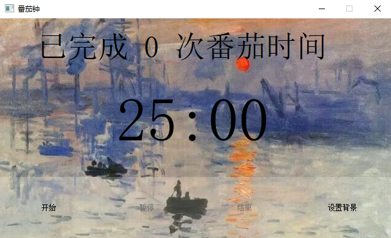
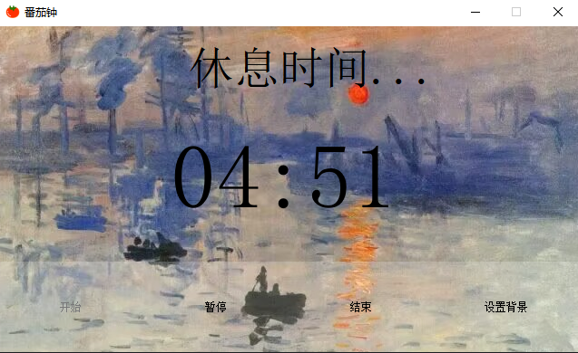

# 番茄钟（基于Pyqt5）

一个基于 PyQt5 的番茄工作法计时器应用，支持背景图片自定义、系统托盘、休息提醒等功能





## 功能特点

- 🍅 标准番茄工作法时间管理
  - 25分钟工作时间
  - 5分钟短休息
  - 每完成4个番茄钟后25分钟长休息
- 💻 简洁的用户界面
  - 清晰的时间显示
  - 已完成番茄钟次数统计
- 🔔 系统托盘支持
  - 最小化到系统托盘
  - 托盘通知提醒
- 🎨 自定义背景
  - 支持自定义背景图片
  - 支持PNG、JPG、JPEG、BMP格式
- 🔄 计时控制
  - 开始/暂停/继续/结束功能
  - 自动切换工作和休息状态
- 📊 进度记录
  - 自动保存完成次数
  - 持久化存储

## 安装说明

### 环境要求
- Python 3.6+
- PyQt5

### 安装步骤

1. 克隆仓库：
```bash
git clone https://github.com/yourusername/tomato-clock.git
cd tomato-clock
```

2. 安装依赖：
```bash
pip install PyQt5
```

3. 运行程序：
```bash
python main.py
```

## 使用说明

1. 开始工作
   - 点击"开始"按钮开始一个25分钟的工作时段
   - 专注工作，避免分心

2. 休息时间
   - 工作时段结束后会自动进入休息时间
   - 短休息5分钟，每完成4个番茄钟后长休息25分钟

3. 暂停/继续
   - 需要临时暂停时，点击"暂停"按钮
   - 准备继续时，点击"继续"按钮

4. 提前结束
   - 如需提前结束当前番茄钟，点击"结束"按钮
   - 注意：提前结束不会计入完成次数

5. 自定义背景
   - 点击"设置背景"按钮
   - 选择本地图片文件
   - 支持PNG、JPG、JPEG、BMP格式

6. 系统托盘
   - 最小化窗口会自动隐藏到系统托盘
   - 点击托盘图标可以重新显示窗口
   - 右键托盘图标可以显示菜单

## 项目结构

```
tomato-clock/
├── main.py          # 程序入口
├── config.py        # 配置管理
├── timer.py         # 计时器核心逻辑
├── window.py        # 主窗口界面
├── ui/
│   └── tomato.py    # UI界面代码
├── img/             # 图片资源目录
│   └── icon.png     # 程序图标
└── music/           # 音频资源目录
    └── finish.wav   # 提示音效
```

- 提示音效必须是 WAV 格式
- 更换背景图片时建议保持与当前背景图片相同的格式
- 连续番茄钟计数在手动结束或关闭程序后会重置

## 贡献

欢迎提交 Issue 和 Pull Request

## 开源协议

本项目采用 MIT 协议开源 - 详见 [LICENSE](LICENSE) 文件